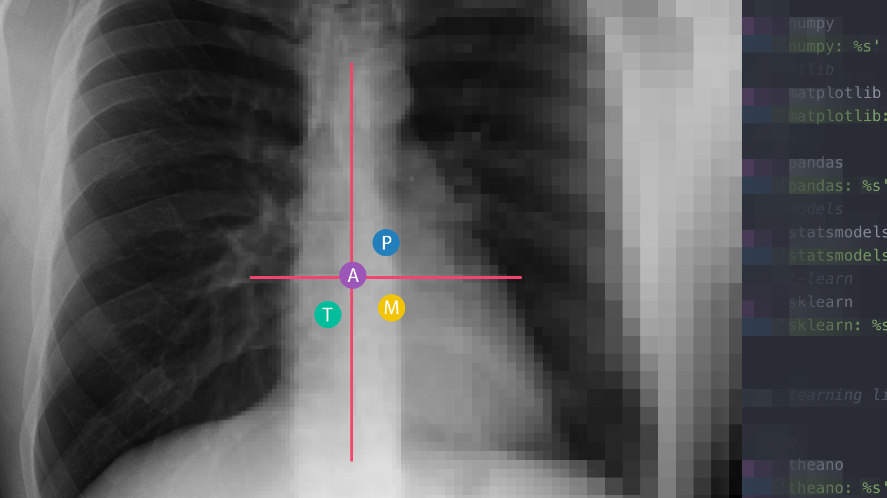

---
aliases:
- /digital health/2021/01/25/built-by-docs
author: Eric M. Baumel
categories:
- digital health
date: '2021-01-25'
description: What kind of healthcare system would you design, if you were doing it
  from the ground up?
layout: post
title: Built By Docs
toc: false

---

## Because the future doesn’t invent itself

Let's get the tired truisms out of the way first, the healthcare system as we know it is broken. 
There are multiple problems throughout the entire system, both large and small. Resources of course - 
time, personnel and money - are finite. Put all of this aside for the moment. What kind of healthcare 
system would you design, if you were doing it from the ground up? What kind of future do you want to 
build? Is it Star Trek or Blade Runner?

> *“May I never see in the patient anything but a fellow creature in pain.”*
>
>  The Oath of Maimonides

Our job in healthcare is to watch over the life and health of our patients, and by extension 
the public at large. 

Technology alone cannot accomplish a solution to all the problems in our communities, to insure 
their health and well-being. But it can set an infrastructure for us to support the building of 
a better system.

Where do we go from here?

What ingredients do we need to bake into healthcare design?

* Interoperability
* Access to information, clearly displayed
* Privacy protections
* Price transparency
* Involvement by clinical healthcare professionals - from the very start

Start building!

*(originally published February 27, 2019 on builtbydocs.com)*
